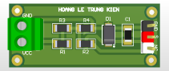

# DC Voltage Sensor

Analog voltage measurement module.

## Function
Scales high voltage to MCU-safe level.

## Key Specifications
- Divider: R1/R2
- Protection: Zener 1N4733A
- Output: Analog pin header

## Hardware Preview

---
Designed by HOANG LE TRUNG KIEN
